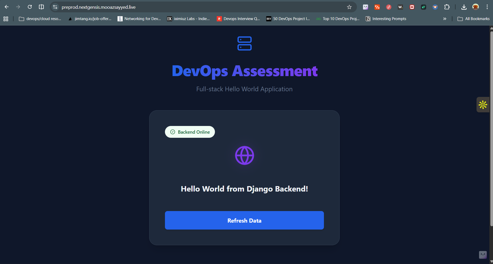
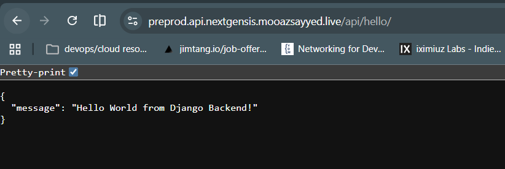

## Assignment is completed, documentation here

* [x] Dockerized frontend-backend
* [x]  Deployed on Cloud (EC2)
* [x]Created cloud resources using Terraform to deploy on AWS
* [x] Used Docker best practices and multistage builds along with no root user to run images.
* [x] Logic for securely copying environment variables  with committing to GitHub
* [x] Complied with all resource management practices. 

# AS asked setup and assignment details in DEVOPS.md by Mooaz Sayyed prev readme.md is pruned

- 📘 [DevOps Guide](DEVOPS.md)

CI/CD setup

## View PRODUCTION application here

https://nextgensis.mooazsayyed.live

## View PRODUCTION API here

https://api.nextgensis.mooazsayyed.live/api/hello 

 

{
"message": "Hello World from Django Backend!"
}

## VIEW PREPRODUCITON APPLICATION HERE  

## VIEW PREPRODUCITON API HERE

https://preprod.api.nextgensis.mooazsayyed.live/api/hello  

 
{
"message": "Hello World from Django Backend!"
}

# EC2 and application SETUP FOR PRE-PROD AND PROD BOTH ATTACHED TO ELASTIC IP

# Added health endpoint to see api health

https://api.nextgensis.mooazsayyed.live/api/health 

 

{
"status": "healthy",
"environment": "production",
"debug": "False",
"timestamp": "2026-01-24T14:42:58Z"
}

## Infrastructure as Code (Terraform)

Terraform was used to provision EC2 instances, security groups, private keys, and Elastic IPs.
[Terraform Directory](./Terraform)  

### Resources Created

- **PRE-PROD EC2 Instance:** `i-0937c46a11f153a92` (devops-assessment-preprod)
- **Elastic IP:** Attached to `i-0937c46a11f153a92`
- **Authentication:** PEM file generated for SSH access.
- **Security Rules:**
  - SSH (Port 22)
  - HTTP (Port 80)
  - HTTPS (Port 443)

### Self-Hosted Runner

A self-hosted runner is configured on the EC2 instance.

**Tags:** `preprod`, `production`
